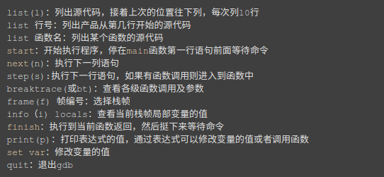
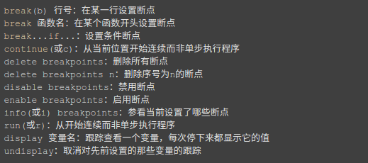
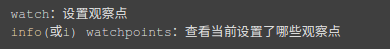
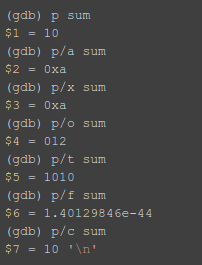

https://my.oschina.net/tashi/blog/191468

GDB的补充：

输出格式：
一般来说，GDB会根据变量的类型输出变量的值。但你也可以自定义GDB的输出的格式。
例如，你想输出一个整数的十六进制，或是二进制来查看这个整型变量的中的位的情况。要
做到这样，你可以使用GDB的数据显示格式： 
x 按十六进制格式显示变量。 
d 按十进制格式显示变量。 
u 按十六进制格式显示无符号整型。 
o 按八进制格式显示变量。 
t 按二进制格式显示变量。 
a 按十六进制格式显示变量。 
c 按字符格式显示变量。 
f 按浮点数格式显示变量。

查看内存：
你可以使用examine命令（简写是x）来查看内存地址中的值。x命令的语法如下所示： 
x/ 
n、f、u是可选的参数。 
n 是一个正整数，表示显示内存的长度，也就是说从当前地址向后显示几个地址的内容。 
f 表示显示的格式，参见上面。如果地址所指的是字符串，那么格式可以是s，如果地十是指令地址，那么格式可以是i。
u 表示从当前地址往后请求的字节数，如果不指定的话，GDB默认是4个bytes。u参数可以用下面的字符来代替，b表示单字节，h表示双字节，w表示四字节，g表示八字节。当我们指定了字节长度后，GDB会从指内存定的内存地址开始，读写指定字节，并把其当作
一个值取出来。 
表示一个内存地址。 
n/f/u三个参数可以一起使用。例如： 
命令：x/3uh 0x54320 表示，从内存地址0x54320读取内容，h表示以双字节为一个单位，3表示三个单位，u表示按十六进制显示。