# Lane confidence

## I.Introduction

Confidence estimation of tracked lanes can be used to detect malfunction and e.g. reset the lane tracking subsystem.

## II.Lane confidence measures

### A.Gradient confidence

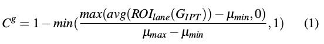

Minimal and maximal relevant gradient values (μmin , μ max ) define a mapping [0 ; 255] → [0 ; 1].

### B.HSV color histogram confidence

HSV has been chosen because it has the advantage of clear separation of color, saturation and intensity channels.
This makes it possible to build a color model that is mostly independent of lighting intensity by limiting the bin number corresponding to intensity.

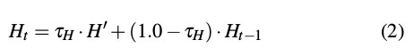
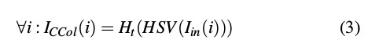
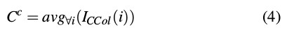

### C.Lane marker confidence
This measure calculates a confidence value using detected lane markers.

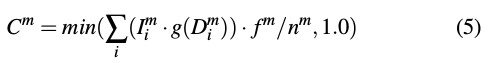

g(x)--normal distribution
n^m^--the number of expected markers
f^m^--an intensity normalization factor

### D. Fusion of lane confidence measures
A combined confidence value of the presented visual confidences.

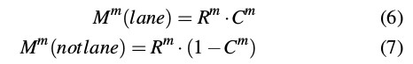
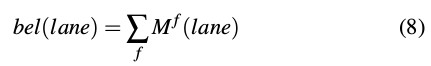
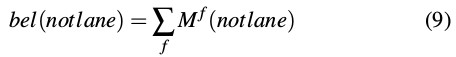
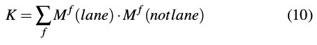

# 其他论文置信度计算
### 置信度公式：
设待处理车道线图像为I，待解算的变形模板参数为**m**=(a,b,c),后验概率函数估计可以表示为：
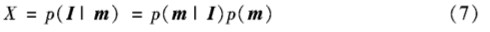
由上式可知，置信度计算公式取决于似然函数p(m|I)和先验概率p(m)。
#### 1. 先验概率
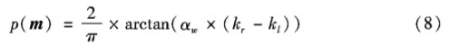
α~m~——车道宽系数，论文中取10
k~r~,k~l~——左右车道线起始点的切线斜率

#### 2. 似然函数
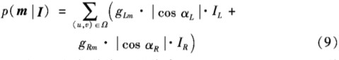
Ω——由左右车道线上的像素及其左右领域内两个像素构成
g~Lm~,g~Rm~——归一化后的梯度值
I~L~,I~R~——归一化后的像素灰度值
α~L~,α~R~——像素梯度方向与左右车道线在该点处法线方向夹角，计算公式为：
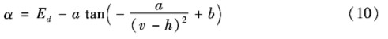
E~d~——像素的梯度方向角

## 其他思路
通过逆透视变换把视频坐标系转换到世界坐标系，根据车道线的平行，距离不变等特性计算置信度。但是mtk的项目没有用到IPM，单独为置信度加入坐标转换有点复杂。