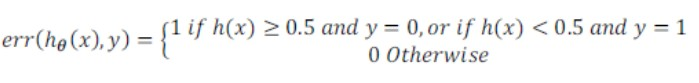
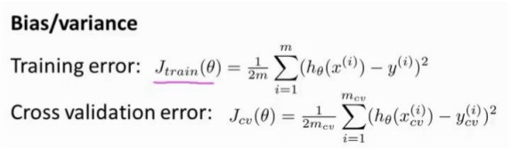
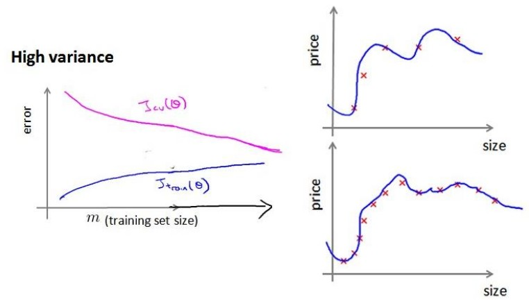

##  十 应用机器学习的建议

### 10.1 Deciding What to Try Next

当我们运用训练好了的模型来预测未知数据的时候发现有较大的误差，我们下一步可以做什么？

1. 获得更多的训练实例————通常是有效的，但代价太大，下面的方法也可能有效，可考虑先采用下面的几种方法。
2. 尝试减少特征的数量。
3. 尝试获得更多的特征。
4. 尝试增加多项式特征。
5. 尝试减少归一化程度λ。
6. 尝试增加归一化程度λ。

我们不应该随机选择上面的某种方法来改进我们的算法，而是运用一些机器学习诊断法来帮助我们知道上面哪些方法对我们的算法是有效的。

###  10.2 Evaluating a Hypothesis(评估一个假设)

为了检验算法是否过拟合，我们将数据分成训练集和测试集，通常用70%的数据作为训练集，用剩下30%的数据作为测试集。很重要的一点是训练集和测试集均要含有各种类型的数据，通常我们要对数据进行“洗牌”，然后再分成训练集和测试集。

通过训练集让我们的模型学习得出其参数后，对测试集运用该模型，我们有两种方式计算误差：

1. 对于线性回归模型，我们利用测试集数据计算代价函数J
2. 对于逻辑回归模型，我们除了可以利用测试数据集来计算代价函数外：

可以对每一个测试集实例，计算：

然后对计算结果求平均。

### 10.3 Model Selection and Train_Validation_Test Sets

假设我们要在10个不同次数的二项式模型之间进行选择，显然次数越高的多项式模型越能够适应我们的训练集，但是适应训练集并不代表这能推广至一般情况，我们应该选择一个更能适应一般情况的模型。我们选择交叉验证集来帮助我们选择模型。

即：使用60%的数据作为训练集，使用20%的数据作为交叉验证集，使用20%的数据作为测试集。

模型选择的方法为：

1. 使用训练集训练出10个模型
2. 用10个模型分别对交叉验证集计算得出交叉验证误差（代价函数的值）
3. 选取代价函数值最小的模型
4. 用步骤3中选出的模型对测试集计算得出推广误差。

### 10.4 Diagnosing Bias vs. Variance（诊断偏差和方差）

当你运行一个学习算法的时候，如果这个算法表现的不理想，那么多半是出现两种情况：要么是偏差比较大（欠拟合），要么是方差比较大（过拟合）。弄清楚一个算法是偏差有问题还是方差有问题，还是两个都有问题对于改进学习算法的效果非常重要。

高偏差和高方差的问题基本上来说是欠拟合和过拟合的问题。

我们通常会将训练集和交叉验证集的代价函数误差与多项式的次数绘制在同一张图标上来帮助分析：

对与训练集，当d较小时，模型拟合程度更低，误差较大；随着d的增长，你和程度提高，误差减小。

对于交叉验证集，当d较小时，模型拟合程度低，误差较大；但是随着d的增长，误差呈现先减小后增大的趋势，转折点是我们的模型开始过拟合训练数据集的时候。

如果我们的交叉验证集误差较大，我们如何判断是方差还是偏差呢？根据上面的图表，我们知道：

训练集误差和交叉验证集误差近似时：偏差/欠拟合
交叉验证集误差远大于训练集误差时：方差/过拟合

### 10.5 Regularization and Bias_Variance(归一化和偏差/方差)

当λ较小时，训练集误差较小（过拟合）而交叉验证集误差较大。

随着λ的增加，训练集误差不断增加（欠拟合），而交叉验证集误差则是先减小后增加。

###  10.6 Learning Curves(学习曲线)

学习曲线是学习算法的一个很好的合理检验（sanity check）。学习曲线是将训练集误差和交叉验证集误差作为训练集实例数量的函数绘制的图表。

即，如果我们有100行数据，我们从1行数据开始，逐渐学习更多行的数据。思想是：当训练较少行数据的时候，训练的模型将能够非常完美地适应较少的训练数据，但是训练出来的模型却不能很好地适应交叉验证集数据或测试集数据。

如何利用学习曲线识别高偏差/欠拟合：作为例子，我们尝试用一条直线来适应下面的数据，可以看出，无论训练集有多么大，误差都不会有太大改观：

也就是说高偏差/欠拟合的情况下，增加数据到训练集不一定能有帮助。

如何识别高方差/过拟合：假设我们使用一个非常高次的多项式模型，并且归一化非常小，可以看出，当交叉验证集误差远大于训练集误差时，往训练集增加更多数据可以提高模型的效果。

### 10.7 Deciding What to Do Next Revisited(决定下一步做什么)

回顾我们之前提出的改进的方法，分别在什么情况下使用呢？

1. 获得更多的训练实例--解决高方差
2. 尝试减少特征的数量--解决高方差
3. 尝试获得更多的特征--解决高偏差
4. 尝试增加多项式特征--解决高偏差
5. 尝试减少归一化程度λ--解决高偏差
6. 尝试增加归一化程度λ--解决高方差

神经网络的方差和偏差：

使用较小的神经网络，类似于参数较少的情况，容易导致高偏差和欠拟合，但计算代价较小。

使用较大的神经网络，类似于参数较多的情况，容易导致高方差和过拟合，虽然计算代价较大，但是可以通过归一化手段来调整而更加适应数据。

通常选择较大的神经网络并采用归一化处理会比采用较小的神经网络效果更好。

对于神经网络中的隐藏层的层数的选择，通常从一层开始逐渐增加层数，为了更好地做选择，可以把数据分为训练集，交叉验证集和测试集，针对不同隐藏层层数的神经网络训练神经网络，然后选择交叉验证集代价最小的神经网络。