##  六 逻辑回归（Logistic Regression）

### 6.1 Classification(分类问题)

逻辑回归算法是分类算法（尽管名字中出现了回归），适用于标签y取值离散的情况。

### 6.2 Hypothesis Representation(假说表示)

逻辑回归模型的假设是：

其中：
X 代表特征向量
g 代表逻辑函数（logistic function） 常用的逻辑函数为S形函数（Sigmoid function），公式为：

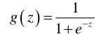

图像为：

合起来，得到逻辑回归模型的假设：

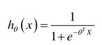

即对于给定的输入变量，根据选择的参数计算输出变量等于1的可能性（estimated probablity）,即
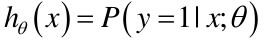

例如，如果对于给定的x，通过计算得出h(x)=0.7，则表示有70%的几率y为正向类，相应的y为负向类的几率为0.3.

### 6.3 Decision Boundary(判定边界)

根据上面的S形函数图像，我们知道θ^T^X>0时 g>0.5
于是g的取值决定于θ^T^X的取值，

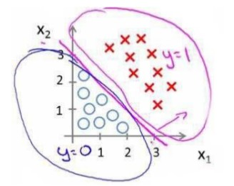

如图我们可以绘制直线x1+x2=3，这条线便是我们模型的分界线，将预测为1的区域和预测为0的区域分隔开。

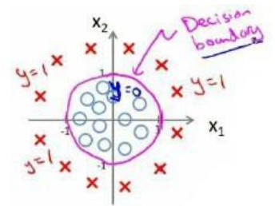

假设参数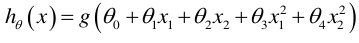是[-1 0 0 1 1]，则我们得到的判定边界恰好是圆心在原点且半径为1的圆形。
我们可以用非常复杂的模型来适应非常复杂形状的判定边界。

### 6.4 Cost Function(代价函数)

对于线性回归模型，我们定义的代价函数是所有模型误差的平方和。理论上来说，我们也可以对逻辑回归模型沿用这个定义，但是问题在于，当我们将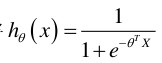带入到这样的代价函数中时，我们得到的代价函数将是一个非凸函数（non-convex function）。

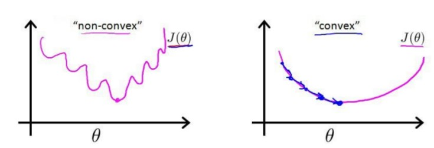

这意味着我们的代价函数有许多局部最小值，这将影响梯度下降算法寻找全局最小值。

我们重新定义逻辑回归的代价函数为：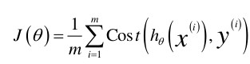

其中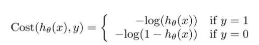

h(X)与Cost(h(X),y)之间的关系如下图所示：

这样构建的Cost(h(x),y)函数的特点是：

当实际的y=1时，
h为1，误差为0；h越小，Cost越大

当实际的y=0时，
h为0，误差为0；h越大，Cost越大

将Cost函数简化如下：

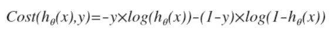

带入代价函数，得到：

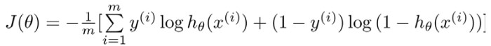

在得到这样一个代价函数后，我们便可以用梯度下降算法来求得能使代价函数最小的参数了，算法为：

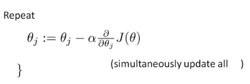

求导后得到：

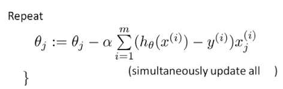

在这个视频中，我们定义了单训练样本的代价函数，凸性分析的内容是超出这门课的范围的，但是可以证明我们所选的代价函数会给我们一个凸优化问题。代价函数J(θ)会是一个凸函数，并且没有局部最优值。

注：虽然得到的梯度下降算法表面上看上去与线性回归的梯度下降算法一样，但是这里的h~θ~(X)=g(θ^T^X)与线性回归中不同，所以实际上是不一样的。另外，在运行梯度下降算法之前，进行特征缩放依旧是非常必要的。

一些梯度下降算法之外的选择：除了梯度下降算法以外，还有一些常被用来令代价函数最小的算法，这些算法更加复杂和优越，而且通常不需要人工选择学习率，通常比梯度下降算法要更加快速。这些算法有：

共轭梯度(Conjugate Gradient)，局部优化法(Broyden fletcher goldfarb shann,BFGS)和有限内存局部优化法（LBFGS）。fminunc是matlab和octave中都带的一个最小值优化函数，使用时我们需要提供代价函数和每个参数的求导，下面是octave中使用fminunc函数的代码示例：

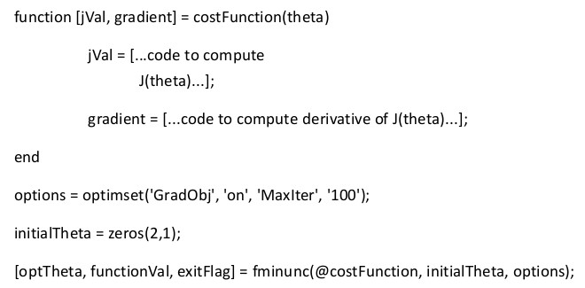

### 6.5 Simplified Cost Function and Gradient Descent(简化的成本函数和梯度下降)

逻辑回归的代价函数：

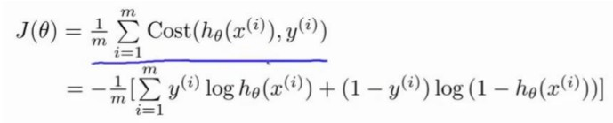

我们的目的是尽量找让J(θ)取得最小值的参数θ。

如果要最小化这个关于θ的函数值，这就是我们通常使用的梯度下降法的模板。

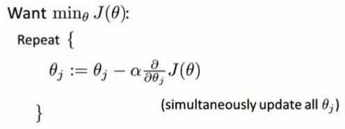

我们反复更新每个参数，用这个式子来更新，就是用它自己减去学习率α乘以后面的微分项，求导后得到：

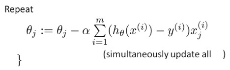

后面这个式子其实就是预测误差乘以x~j~^(i)^

这个式子和我们用来做线性回归梯度下降的式子相同。那么，线性回归和逻辑回归有什么区别呢？

实际上，假设函数的定义发生了变化：

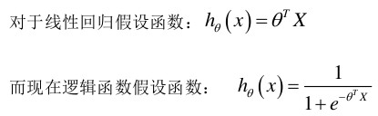

因此，即使更新参数的规则看起来基本相同，但由于假设的定义发生了变化，所以逻辑回归的梯度下降和线性回归的梯度下降实际上是两个完全不同的东西。

特征缩放在逻辑回归同样适用。

### 6.6 Advanced Optimization（高级优化）

fminunc函数可以调用高级的优化函数，它表示Octave里无约束最小化函数。调用它的方式如下：

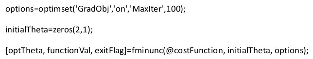

costFunction函数我们自己写的，返回代价函数和梯度值。

### Multiclass Classfication(多类别分类)

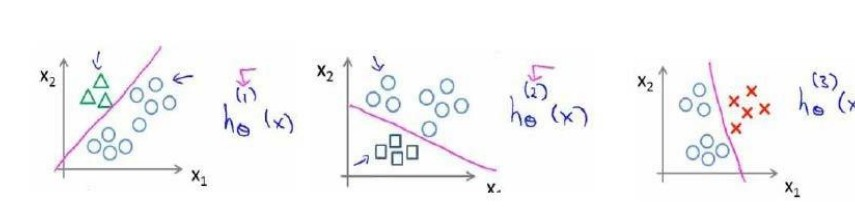

我们将多个类中的一个类标记为正向类（y=1），然后将其他所有类都标记为负向类，以此类推。

最后，在我们需要做预测的时候，我们将所有的分类机都运行一遍，然后对每一个输入变量，都选择最高可能性的输出变量。