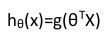
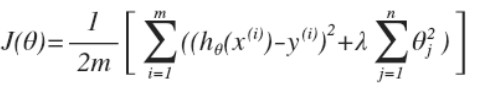
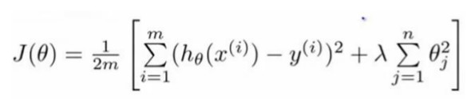
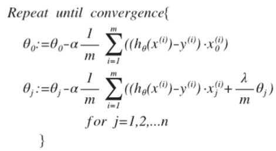
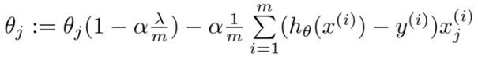
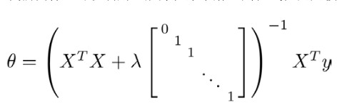
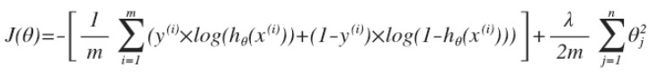
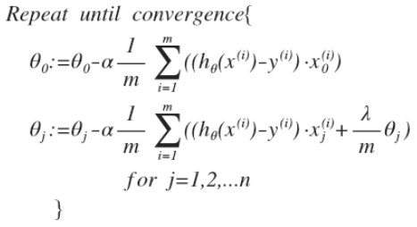

##  六 逻辑回归（Logistic Regression）

### 6.1 Classification(分类问题)

逻辑回归算法是分类算法（尽管名字中出现了回归），适用于标签y取值离散的情况。

### 6.2 Hypothesis Representation(假说表示)

逻辑回归模型的假设是：

其中：
X 代表特征向量
g 代表逻辑函数（logistic function） 常用的逻辑函数为S形函数（Sigmoid function），公式为：

图像为：

合起来，得到逻辑回归模型的假设：

即对于给定的输入变量，根据选择的参数计算输出变量等于1的可能性（estimated probablity）,即

例如，如果对于给定的x，通过计算得出h(x)=0.7，则表示有70%的几率y为正向类，相应的y为负向类的几率为0.3.

### 6.3 Decision Boundary(判定边界)

根据上面的S形函数图像，我们知道θ^T^X>0时 g>0.5
于是g的取值决定于θ^T^X的取值，

如图我们可以绘制直线x1+x2=3，这条线便是我们模型的分界线，将预测为1的区域和预测为0的区域分隔开。

假设参数是[-1 0 0 1 1]，则我们得到的判定边界恰好是圆心在原点且半径为1的圆形。
我们可以用非常复杂的模型来适应非常复杂形状的判定边界。

### 6.4 Cost Function(代价函数)

对于线性回归模型，我们定义的代价函数是所有模型误差的平方和。理论上来说，我们也可以对逻辑回归模型沿用这个定义，但是问题在于，当我们将带入到这样的代价函数中时，我们得到的代价函数将是一个非凸函数（non-convex function）。

这意味着我们的代价函数有许多局部最小值，这将影响梯度下降算法寻找全局最小值。

我们重新定义逻辑回归的代价函数为：

其中

h(X)与Cost(h(X),y)之间的关系如下图所示：

这样构建的Cost(h(x),y)函数的特点是：

当实际的y=1时，
h为1，误差为0；h越小，Cost越大

当实际的y=0时，
h为0，误差为0；h越大，Cost越大

将Cost函数简化如下：

带入代价函数，得到：

在得到这样一个代价函数后，我们便可以用梯度下降算法来求得能使代价函数最小的参数了，算法为：

求导后得到：

在这个视频中，我们定义了单训练样本的代价函数，凸性分析的内容是超出这门课的范围的，但是可以证明我们所选的代价函数会给我们一个凸优化问题。代价函数J(θ)会是一个凸函数，并且没有局部最优值。

注：虽然得到的梯度下降算法表面上看上去与线性回归的梯度下降算法一样，但是这里的h~θ~(X)=g(θ^T^X)与线性回归中不同，所以实际上是不一样的。另外，在运行梯度下降算法之前，进行特征缩放依旧是非常必要的。

一些梯度下降算法之外的选择：除了梯度下降算法以外，还有一些常被用来令代价函数最小的算法，这些算法更加复杂和优越，而且通常不需要人工选择学习率，通常比梯度下降算法要更加快速。这些算法有：

共轭梯度(Conjugate Gradient)，局部优化法(Broyden fletcher goldfarb shann,BFGS)和有限内存局部优化法（LBFGS）。fminunc是matlab和octave中都带的一个最小值优化函数，使用时我们需要提供代价函数和每个参数的求导，下面是octave中使用fminunc函数的代码示例：

### 6.5 Simplified Cost Function and Gradient Descent(简化的成本函数和梯度下降)

逻辑回归的代价函数：

我们的目的是尽量找让J(θ)取得最小值的参数θ。

如果要最小化这个关于θ的函数值，这就是我们通常使用的梯度下降法的模板。

我们反复更新每个参数，用这个式子来更新，就是用它自己减去学习率α乘以后面的微分项，求导后得到：

后面这个式子其实就是预测误差乘以x~j~^(i)^

这个式子和我们用来做线性回归梯度下降的式子相同。那么，线性回归和逻辑回归有什么区别呢？

实际上，假设函数的定义发生了变化：

因此，即使更新参数的规则看起来基本相同，但由于假设的定义发生了变化，所以逻辑回归的梯度下降和线性回归的梯度下降实际上是两个完全不同的东西。

特征缩放在逻辑回归同样适用。

### 6.6 Advanced Optimization（高级优化）

fminunc函数可以调用高级的优化函数，它表示Octave里无约束最小化函数。调用它的方式如下：

costFunction函数我们自己写的，返回代价函数和梯度值。

### Multiclass Classfication(多类别分类)

我们将多个类中的一个类标记为正向类（y=1），然后将其他所有类都标记为负向类，以此类推。

最后，在我们需要做预测的时候，我们将所有的分类机都运行一遍，然后对每一个输入变量，都选择最高可能性的输出变量。

## 七 Regularization(正则化)

### 7.1 The problem of Overfitting(过拟合问题)

欠拟合：不能很好的适应我们的训练集。

过拟合：能非常好地适应我们的训练集但在新输入变量进行预测时可能会效果不好。

我们发现了过拟合问题，应该如何处理？

1. 丢弃一些不能帮助我们正确预测的特征。可以是手工选择保留哪些特征，或者使用一些模型选择的算法来帮忙（例如PCA）
2. 正则化。保留所有的特征，但是减小参数的大小。

### 7.2 Cost Function(代价函数)

从之前的事例中可以看出，正是那些高次项导致了过拟合的产生，所以如果我们能让这些高次项的系数接近于0的话，我们就能很好的拟合了。

假如我们有非常多的特征，我们并不知道其中哪些特征我们要惩罚，我们将对所有的特征进行惩罚，并且让代价函数最优化的软件来选择这些惩罚的程度，这样的结果是的到了一个较为简单的能防止过拟合问题的假设：

其中λ又称为正则化参数（Regularization Parameter）。注：根据惯例，我们不对θ0进行惩罚。

如果选择的正则化参数λ过大，则会把所有的参数都最小化了，导致模型变成hθ(X)=θ0，造成欠拟合。 

### 7.3 Regularized Linear Regression(正则化线性回归)

对于线性回归的求解，我们之前推导了两种学习算法：一种基于梯度下降，一种基于正规方程。

正则化线性回归方程的代价函数为：

如果我们要使用梯度下降法令这个代价函数最小化，因为我们未对θ0进行正则化，所以梯度下降算法将分为两种情形：

对上面的算法中，j=1,2，...n时的更新式子进行调整可得：

可以看出，正则化线性回归的梯度下降算法的变化在于，每次都在原有算法更新规则的基础上令θ值减少了一个额外的值。

我们同样也可以利用正规方程来求解正则化线性回归模型，方法如下图所示：

图中矩阵的尺寸为（n+1）*(n+1)。

### Regularized Logistic Regression(正则化的逻辑回归模型)

对于逻辑回归，我们也给代价函数增加一个正则化的表达式，得到代价函数：

要最小化该代价函数，通过求导，得出梯度下降算法为：

注：看上去和线性回归一样，但是hθ(x)=g(θTx)，所以与线性回归不同。

octave中，我们依旧可以用fminuc函数来求解代价函数最小化的参数，值得注意的是参数θ0的更新规则与其他情况不同。

注：
1. 虽然正则化的逻辑回归中的梯度下降和正则化的线性回归中的表达式看起来一样，但由于两者的h(x)不同所以还是有很大差别。
2. θ0不参与其中的任何一个正则化。