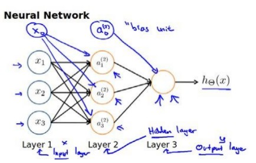
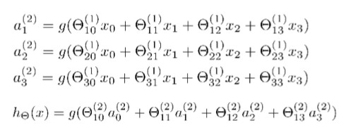
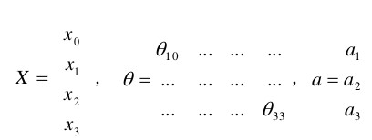

## 八 Neural Network Representation(神经网络：表述)

### 8.1 Non-linear Hypotheses(非线性假设)

我们之前学的，无论是线性回归还是逻辑回归都有这样一个缺点，即：当特征太多时，计算的负荷会非常大。

这时候我们需要神经网络。

### 8.2 Neurons and the Brain（神经元和大脑）

我们需要做的就是找出一些近似的或实际的大脑学习算法，然后实现它通过自学掌握如何处理这些不同类型的数据。

### 8.3 MOdel Representation(模型表示)

神经网络模型是许多逻辑单元按照不同的层级组织起来的网络，每一层的输出变量都是下一层的输入变量。下图为一个3层的神经网络，第一层为输入层（Input Layer），最后一层为输出层（Output Layer），中间为隐藏层（HIdden Layer）。我们为每一层都增加一个偏差单位（bias unit）:

下面引入一些标记法来帮助描述模型：

a^(j)^~i~代表第j层的第i个激活单元。

θ^(j)^代表从第j层映射到第j+1层时的权重矩阵，其尺寸为（第j+1层的激活单元数量 × 第j层的激活单元数加一）注:因为有偏差单位（一般为1）

对于上图模型，激活单元和输出分别表达为：

上面进行的讨论只是将特征矩阵的一行（一个训练实例）喂给了神经网络，我们需要将整个训练集都喂给我们的神经网络算法来学习模型。

我们可以知道：每一个a都是由上一层所有的x和每一个x所对应的决定的。（我们把这样的从左到右的算法称为前向传播算法（Forward Propagation））

把x,θ,a分别用矩阵表示：

我们可以得到θ*x = a

