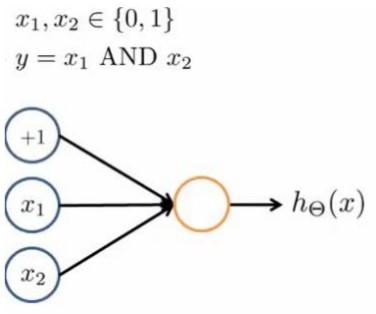
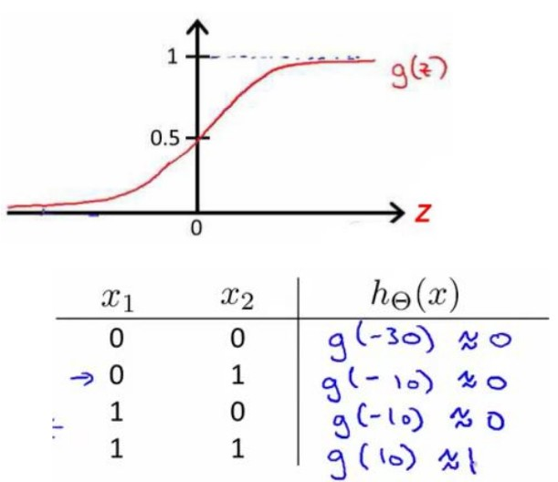
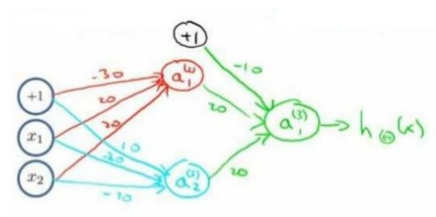

## 八 Neural Network Representation(神经网络：表述)

### 8.1 Non-linear Hypotheses(非线性假设)

我们之前学的，无论是线性回归还是逻辑回归都有这样一个缺点，即：当特征太多时，计算的负荷会非常大。

这时候我们需要神经网络。

### 8.2 Neurons and the Brain（神经元和大脑）

我们需要做的就是找出一些近似的或实际的大脑学习算法，然后实现它通过自学掌握如何处理这些不同类型的数据。

### 8.3 MOdel Representation(模型表示)

神经网络模型是许多逻辑单元按照不同的层级组织起来的网络，每一层的输出变量都是下一层的输入变量。下图为一个3层的神经网络，第一层为输入层（Input Layer），最后一层为输出层（Output Layer），中间为隐藏层（HIdden Layer）。我们为每一层都增加一个偏差单位（bias unit）:

下面引入一些标记法来帮助描述模型：

a^(j)^~i~代表第j层的第i个激活单元。

θ^(j)^代表从第j层映射到第j+1层时的权重矩阵，其尺寸为（第j+1层的激活单元数量 × 第j层的激活单元数加一）注:因为有偏差单位（一般为1）

对于上图模型，激活单元和输出分别表达为：

上面进行的讨论只是将特征矩阵的一行（一个训练实例）喂给了神经网络，我们需要将整个训练集都喂给我们的神经网络算法来学习模型。

我们可以知道：每一个a都是由上一层所有的x和每一个x所对应的决定的。（我们把这样的从左到右的算法称为前向传播算法（Forward Propagation））

把x,θ,a分别用矩阵表示：

我们可以得到θ*x = a

### 8.4 Model Representation II(模型表示2)

相对使用循环来编码，利用向量化的方法会使得计算更为简便。

其实神经网络就像是logistic regression，只不过我们把logistic regression中的驶入向量[x1~x3]变成了中间层的[a(2)1~a(2)3].

我们可以把a0~a3看成是更为高级的特征值，也就是x0~x3的进化体，并且它们是由x决定的，因为是梯度下降的，并且变得越来越厉害，所以这些更高级的特征值远比仅仅x次方厉害，也能更好的预测新数据。

这就是神经网络相比于逻辑回归和线性回归的优势。

### 8.5 Example and Intuitions I(特征和直观理解)

从本质上讲，神经网络能够通过学习得出其自身的一系列特征。在普通的逻辑回归中，我们被限制为使用数据中的原始特征x1~xn，我们虽然可以使用一些二项式项来组合这些特征，但是我们仍然受到这些原始特征的限制。

在神经网络中，原始特征只是输入层，在我们上面三层的神经网络例子中，第三层也就是输出层做出的预测利用的是第二层的特征，而非输入层的原始特征，我们可以认为第二层的特征是神经网络通过学习后自己得出的一系列预测输出变量的新特征。

神经网络中，单层神经元（无中间层）的计算可以用来表示逻辑运算，比如逻辑与AND，逻辑或OR。

我们可以用这样一个神经网络表示AND函数：

其中θ0=-30,θ1=20,θ2=20

我们的输出函数h(x)即为：

hθ(x)=g(-30+20x1+20x2)

所以我们有：hθ(x)~= x1 AND x2

OR函数与AND整体一样，区别只在于θ取值不同。

θ0=-10,θ1=20,θ2=20

### 8.6 Example and Intuitions II

二元逻辑运算符（Binary logical operators）当输入特征为布尔值（0或1）时，我们可以用一个单一的激活层作为二元逻辑运算符，为了表示不同的运算符，我们只需要选择不同的权重即可。

逻辑与（AND） 三个权重分别为（-30,20,20）

逻辑或（OR）三个权重分别为（-10,20,20）

逻辑非（NOT）两个权重分别为（10,20）

我们可以利用神经元来组合成更为复杂的神经网络以实现更复杂的运算。

例如我们要实现同或（XNOR）功能，即XNOR=(x1 AND x2)OR(NOT x1)AND(NOT x2)

a XOR b = ((NOT a) AND b) OR (a AND (NOT b));

a XNOR b = NOT (a XOR b) = (a AND b) OR ((NOT a) AND (NOT b))

将神经元进行组合，我们就得到了一个能实现XNOR运算符功能的神经网络。

按这种方法我们可以逐渐构造出越来越复杂的函数，也能得到更加厉害的特征值，这就是神经网络的厉害之处。

### 8.7 Multiclass Classification（多样分类）

当我们有不止两种分类时(也就是y=1,2,3...)比如我们要训练一个神经网络算法来识别路人，汽车，摩托车和卡车，在输出层我们应该有4个值。例如，第一个值为1或0用于预测是否是行人。

这时我们用逻辑回归的one vs all，对每一个class都进行预测。

