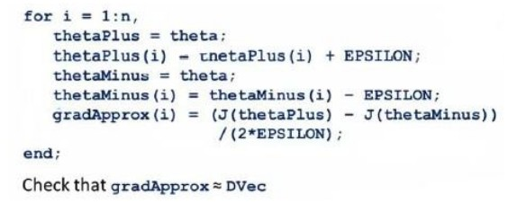

##  九 Neural Networks Learning（神经网络的学习）

### 9.1 Cost Function

我们引入一些便于稍后讨论的新标记方法：

m:神经网络的训练样本个数，每组包含一组输入x和一组输出y

L:表示神经网络的层数

Si:表示第i层的neuron个数（SL表示输出层神经元个数）

将神经网络的分类定义为两种情况：二类分类和多类分类：

二类分类：SL=1，y=0或1

K类分类：Sk=K,yi=1表示分到第i类（K>2）

逻辑回归问题中我们的代价函数为：

在逻辑回归中，我们只有一个输出变量，又称标量（scalar），也只有一个因变量y，但是在神经网络中，我们可以有很多输出变量，我们的h(x)是一个维度为K的向量，并且我们训练集中的因变量也是同样维度的一个向量，因此我们的代价函数会比逻辑回归更加复杂：

背后的思想是一样的，我们希望通过代价函数来观察算法预测的结果与真实情况的误差有多大，唯一不同的是，对于每一行特征，我们都会给出K个预测，基本上我们可以利用循环，对每一行特征都预测K个不同的结果，然后再利用循环在K个预测中选择可能性最高的一个，将其与y中的实际数据进行比较。

正规化的那一项只是排除了每一层的θ0后，每一层θ矩阵的和。

### 9.2 Backpropagation Algorithm（反向传播算法）

之前我们在计算神经网络预测结果的时候采用了一种正向传播算法，我们从第一层开始一层层进行计算，直到最后一层的hθ(x)。

现在，为了计算代价函数的偏导数，我们需要采用一种反向传播算法，也就是首先计算最后一层的误差，然后再一层层反向求出各层的误差，直到倒数第二层。以一个例子来说明反向传播算法。

假设我们的训练集只有一个实例（x(1),y(1)）,我们的神经网络是一个四层的神经网络，其中K=4,SL=4,L=4：

前向传播算法：

我们从最后一层的误差开始计算，误差是激活单元的预测（a(4)k）与实际值（yk）之间的误差（k=1:K）

我们用δ来表示误差，则：

我们利用这个误差值来计算前一层的误差：

其中,而则是权重导致的误差的和。

下一步是继续计算第二层的误差：

因为第一层是输入变量，不存在误差。我们有了所有的误差的表达式后，便可以计算代价函数的偏导数了，假设λ=0，即我们不做任何归一化处理时，有：

重要的是清楚地知道上面式子中上下标的含义：

l:代表目前所计算的是第几层
j:代表目前计算层中的激活单元的下标，也将是下一层的第j个输入变量的下标。
i:代表下一层中误差单元的下标，是受到权重矩阵中第i行影响的下一层中的误差单元的下标。

如果我们考虑正规化处理，并且我们的训练集是一个特征矩阵而非向量。在上面的特殊情况中，我们需要计算每一层的误差单元来计算代价函数的偏导数。在更为一般的情况中，我们同样需要计算每一层的误差单元，但是我们需要为整个训练集计算误差单元，此时的误差单元也是一个矩阵，我们用来表示这个误差矩阵。第l层的第i个激活单元受到第j个参数影响而导致的误差。

我们的算法表示为：

即首先用正向传播方法计算出每一层的激活单元，利用训练集的结果与神经网络预测的结果求出最后一层的误差，然后利用该误差运用反向传播算法计算出直至第二层的所有误差。

在求出了之后，我们便可以计算函数的偏导数了，计算方法如下：

在Octave中，如果我们要使用fminuc这样的优化算法来求解求出权重矩阵，我们需要将矩阵首先展开成为向量，在利用算法求出最优解后再重新转换回矩阵。

假设我们有三个权重矩阵，Theta1,Theta2和Theta3，尺寸分别为10*11,10*11和1*11,下面的代码可以实现这样的转换：

### 9.3 Backpropagation Intuition(反向传播算法的直观理解)

反向传播算法做的是：

### 9.4 Implementation Note_Unrolling Parameters(展开参数)

这节介绍怎样把参数从矩阵展开成向量，以便我们在高级最优化步骤中的使用需要。

### 9.5 Grandient Checking(梯度检验)

我们通过估计梯度值来检验我们计算的导数值是否真的是我们要求的。

当θ是一个向量时，我们则需要对偏导数进行检验。

### 9.6 Random Initialization(随机初始化)

如果我们令所有的初始参数相同，这意味着我们每层的激活单元都会有相同的值，我们通常初始参数为正负ε之间的随机值，假设我们要初始一个尺寸为10 * 11的参数矩阵，代码如下：
Theta1 = rand(10,11)*(2*eps)-eps
一般ε取0.12

### 9.7 Putting It Together

小结一下使用神经网络时的步骤：】

网络结构：第一件事是选择网络结构，即决定有多少层以及每层分别有多少个单元。

第一层的单元数即我们训练集的特征数量。
最后一层的单元数是我们训练集的结果的类的数量。
如果隐藏层数大于1，一般使每个隐藏层的单元个数相同，通常情况下隐藏层单元的个数越多越好。

训练神经网络：

1. 参数的随机初始化
2. 利用正向传播方法计算所有的hθ(x)
3. 编写计算代价函数J的代码
4. 利用反向传播方法计算所有的偏导数
5. 利用数值检验方法检验这些偏导数
6. 使用优化算法或梯度下降算法来最小化这些偏导数

