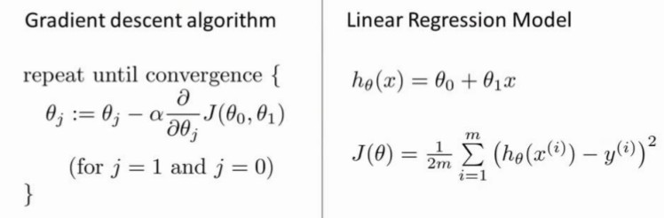
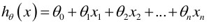
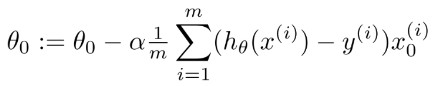
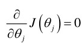

# Machine Learning 笔记

## 第一周

### 一 引言(Introduction)

#### 1.2 What is Machine Learning

第一个机器学习的定义来自于 Arthur Samuel。他定义机器学习为,在进行特定编程的情况下,给予计算机学习能力的领域。

另一个年代近一点的定义,由 Tom Mitchell 提出,来自卡内基梅隆大学,Tom 定义的机器学习是,一个好的学习问题定义如下,他说,一个程序被认为能从经验 E 中学习,解决任务 T,达到性能度量值P,当且仅当,有了经验 E 后,经过 P 评判,程序在处理 T 时的性能有所提升。

学习算法最常用两个类型就是监督学习、无监督学习。

#### 1.3 Supervised Learning

监督学习指的就是我们给学习算法一个数据集。这个数据集由“正确答案”组成,然后运用学习算法,算出更多的正确答案。

回归这个词的意思是,我们在试着推测出这一系列连续值属性。

分类指的是,我们试着推测出离散的输出值。

我们以后会讲一个算法,叫支持向量机,里面有一个巧妙的数学技巧,能让计算机处理无限多个特征。

#### 1.4 Unsupervised Learning

无监督学习算法可能会把这些数据分成两个不同的簇。所以叫做聚类算法。

聚类只是无监督学习中的一种。

无监督学习,它是学习策略,交给算法大量的数据,并让算法为我们从数据中找出某种结构。

### 二 单变量线性回归(Linear Regression with One Variable)

#### 2.1 Model Respresentation（模型表示）

这就是一个监督学习算法的工作方式,我们可以看到这里有我们的训练集里房屋价格。我们把它喂给我们的学习算法,学习算法的工作了,然后输出一个函数,通常表示为小写 h表示。h 代表 hypothesis(假设) ,h 表示一个函数,输入是房屋尺寸大小,就像你朋友想出售的房屋,因此 h 根据输入的 x 值来得出 y 值,y 值对应房子的价格 因此,h 是一个从x 到 y 的函数映射。

我将选择最初的使用规则 h 代表 hypothesis,因而,要解决房价预测问题,我们实际上是要将训练集“喂”给我们的学习算法,进而学习得到一个假设 h,然后将我们要预测的房屋的尺寸作为输入变量输入给 h,预测出该房屋的交易价格作为输出变量输出为结果。那么,对于我们的房价预测问题,我们该如何表达 h?

一种可能的表达方式为:, 因为只含有一个特征/输入变量,因此这样的问题叫作单变量线性回归问题。

#### 2.2 Cost Function（代价函数）

我们现在要做的便是为我们的模型选择合适的参数(parameters)：θ0和θ1。

我们选择的参数决定了我们得到的直线相对于我们的训练集的准确程度,模型所预测的值与训练集中实际值之间的差距就是建模误差(modeling error)。

我们的目标便是选择出可以使得建模误差的平方和能够最小的模型参数。 即使得代价函数 最小。

我们绘制一个等高线图,三个坐标分别为θ0和θ1和J(θ0,θ1):

则可以看出在三维空间中存在一个使得J(θ0,θ1)最小的点。

代价函数也被称作平方误差函数,有时也被称为平方误差代价函数。我们之所以要求出误差的平方和,是因为误差平方代价函数,对于大多数问题,特别是回归问题,都是一个合理的选择。还有其他的代价函数也能很好地发挥作用,但是平方误差代价函数可能是解决回归问题最常用的手段了。

#### 2.5 Gradient Descent（梯度下降）

梯度下降是一个用来求函数最小值的算法,我们将使用梯度下降算法来求出代价函数J(θ0,θ1)的最小值。

梯度下降背后的思想是:开始时我们随机选择一个参数的组合(θ 0 ,θ 1 ,...,θ n ),计算代价函数,然后我们寻找下一个能让代价函数值下降最多的参数组合。我们持续这么做直到到到一个局部最小值(local minimum),因为我们并没有尝试完所有的参数组合,所以不能确定我们得到的局部最小值是否便是全局最小值(global minimum),选择不同的初始参数组合,可能会找到不同的局部最小值。

批量梯度下降(batch gradient descent)算法的公式为:

其中 α 是学习率(learning rate),它决定了我们沿着能让代价函数下降程度最大的方向向下迈出的步子有多大,在批量梯度下降中,我们每一次都同时让所有的参数减去学习速率乘以代价函数的导数。

实现梯度下降算法的微妙之处是,在这个表达式中,如果你要更新这个等式,你需要同时更新 θ0和θ1:

#### 2.7 GradientDescentForLinearRegression（梯度下降的线性回归）

梯度下降算法和线性回归算法比较如图:

对我们之前的线性回归问题运用梯度下降法,关键在于求出代价函数的导数,即:

则算法改写成:

我们刚刚使用的算法,有时也称为批量梯度下降。实际上,在机器学习中,通常不太会给算法起名字,但这个名字”批量梯度下降”,指的是在梯度下降的每一步中,我们都用到了所有的训练样本,在梯度下降中,在计算微分求导项时,我们需要进行求和运算,所以,在每一个单独的梯度下降中,我们最终都要计算这样一个东西,这个项需要对所有 m 个训练样本求和。因此,批量梯度下降法这个名字说明了我们需要考虑所有这一"批"训练样本,而事实上,有时也有其他类型的梯度下降法,不是这种"批量"型的,不考虑整个的训练集,而是每次只关注训练集中的一些小的子集。在后面的课程中,我们也将介绍这些方法。

### 三 线性代数回顾(Linear Algebra Review)

主要是线代的一些基本概念。

## 第二周

### 四 多变量线性回归(Linear Regression with Multiple Variables)

#### 4.1 Multiple Features(多维特征)

支持多变量的假设 h 表示为:

这个公式中有 n+1 个参数和 n 个变量,为了使得公式能够简化一些,引入 x0 =1。

此时模型中的参数是一个 n+1 维的向量,任何一个训练实例也都是 n+1 维的向量,特征矩阵 X 的维度是 m*(n+1)。 因此公式可以简化为:

#### 4.2 Gradient Descent for Multiple Variables(多变量梯度下降)

与单变量线性回归类似,在多变量线性回归中,我们也构建一个代价函数,则这个代价函数是所有建模误差的平方和,即:

我们的目标和单变量线性回归问题中一样,是要找出使得代价函数最小的一系列参数。多变量线性回归的批量梯度下降算法为:

求导数后得到:

当 n>=1 时,

我们开始随机选择一系列的参数值,计算所有的预测结果后,再给所有的参数一个新的值,如此循环直到收敛。

#### 4.3 Gradient Descent in Practice I - Feature Scaling（梯度下降法实践1-特征缩放）

在我们面对多维特征问题的时候,我们要保证这些特征都具有相近的尺度,这将帮助梯度下降算法更快地收敛。
以房价问题为例,假设我们使用两个特征,房屋的尺寸和房间的数量,尺寸的值为 0-2000 平方英尺,而房间数量的值则是 0-5,以两个参数分别为横纵坐标,绘制代价函数的等高线图能,看出图像会显得很扁,梯度下降算法需要非常多次的迭代才能收敛。

解决的方法是尝试将所有特征的尺度都尽量缩放到-1 到 1 之间。如图:

最简单的方法是令:

其中μn是平均值,sn是标准差。

#### 4.4 Gradient Descent in Practice II - Learning Rate（梯度下降法实践2-学习率）

梯度下降算法收敛所需要的迭代次数根据模型的不同而不同,我们不能提前预知,我们可以绘制迭代次数和代价函数的图表来观测算法在何时趋于收敛。

也有一些自动测试是否收敛的方法,例如将代价函数的变化值与某个阀值(例如 0.001)进行比较,但通常看上面这样的图表更好。

梯度下降算法的每次迭代受到学习率的影响,如果学习率 α 过小,则达到收敛所需的迭代次数会非常高;如果学习率 α 过大,每次迭代可能不会减小代价函数,可能会越过局部最小值导致无法收敛。

通常可以考虑尝试些学习率:
α=0.01,0.03,0.1,0.3,1,3,10

#### 4.5 Features and Polynomial Regression（特征和多项式回归）

线性回归并不适用于所有数据,有时我们需要曲线来适应我们的数据，通常我们需要先观察数据然后再决定准备尝试怎样的模型。 另外,我们可以令:

x~2~ = x~2~^2^
x~3~ = x~3~^3^

从而将模型转化为线性回归模型。
根据函数图形特性,我们还可以使:

#### 4.6 Normal Equation（正规方程）

到目前为止,我们都在使用梯度下降算法,但是对于某些线性回归问题,正规方程方法是更好的解决方案。如:

正规方程是通过求解下面的方程来找出使得代价函数最小的参数的:

假设我们的训练集特征矩阵为 X(包含了x0=1)并且我们的训练集结果为向量 y,则利用正规方程解出向量

以下表示数据为例:

即：

运用正规方程方法求解参数:

在 Octave 中,正规方程写作:

注:对于那些不可逆的矩阵(通常是因为特征之间不独立,如同时包含英尺为单位的尺寸和米为单位的尺寸两个特征,也有可能是特征数量大于训练集的数量),正规方程方法是不能用的。

梯度下降与正规方程的比较:

总结一下,只要特征变量的数目并不大,标准方程是一个很好的计算参数 θ 的替代方法。具体地说,只要特征变量数量小于一万,我通常使用标准方程法,而不使用梯度下降法。

随着我们要讲的学习算法越来越复杂,例如,当我们讲到分类算法,像逻辑回归算法,我们会看到, 实际上对于那些算法,并不能使用标准方程法。对于那些更复杂的学习算法,我们将不得不仍然使用梯度下降法。因此,梯度下降法是一个非常有用的算法,可以用在有大量特征变量的线性回归问题。或者我们以后在课程中,会讲到的一些其他的算法,因为标准方程法不适合或者不能用在它们上。但对于这个特定的线性回归模型,标准方程法是一个比梯度下降法更快的替代算法。所以,根据具体的问题,以及你的特征变量的数量,这两种算法都是值得学习的。

#### 4.7 Normal Equation Noninvertibility(正规方程及不可逆性)

有些矩阵可逆,而有些矩阵不可逆。我们称那些不可逆矩阵为奇异或退化矩阵。

问题的重点在于 X'X 的不可逆的问题很少发生,在 Octave 里,如果你用它来实现 θ 的计算,你将会得到一个正常的解。在 Octave 里,有两个函数可以求解矩阵的逆,一个被称为 pinv(),另一个是 inv(),这两者之间的差异是些许计算过程上的,一个是所谓的伪逆,另一个被称为逆。使用 pinv() 函数可以展现数学上的过程,这将计算出 θ 的值,即便矩阵 X'X是不可逆的。

在 pinv() 和 inv() 之间,又有哪些具体区别呢 ?

其中 inv() 引入了先进的数值计算的概念。例如,在预测住房价格时,如果 x 1 是以英尺为尺寸规格计算的房子,x 2 是以平方米为尺寸规格计算的房子,同时,你也知道 1 米等于3.28 英尺 ( 四舍五入到两位小数 ),这样,你的这两个特征值将始终满足约束:x1=x2*(3.28)^2^。

实际上,你可以用这样的一个线性方程,来展示那两个相关联的特征值,矩阵 X'X 将是不可逆的。

第二个原因是,在你想用大量的特征值,尝试实践你的学习算法的时候,可能会导致矩阵 X'X 的结果是不可逆的。

具体地说,在 m 小于或等于 n 的时候,例如,有 m 等于 10 个的训练样本也有 n 等于100 的特征数量。要找到适合的 ( n +1 ) 维参数矢量 θ 这是第 n+1 维,这将会变成一个 101维的矢量,尝试从 10 个训练样本中找到满足 101 个参数的值,这工作可能会让你花上一阵子时间,但这并不总是一个好主意。因为,正如我们所看到 你只有 10 个样本,以适应这100 或 101 个参数,数据还是有些少。

稍后我们将看到,如何使用小数据样本以得到这 100 或 101 个参数,通常,我们会使用一种叫做正则化的线性代数方法,通过删除某些特征或者是使用某些技术,来解决当 m 比n 小的时候的问题。即使你有一个相对较小的训练集,也可使用很多的特征来找到很多合适的参数。

总之当你发现的矩阵 X'X 的结果是奇异矩阵,或者找到的其它矩阵是不可逆的,我会建议你这么做。

首先,看特征值里是否有一些多余的特征,像这些 x 1 和 x 2 是线性相关的,互为线性函数。同时,当有一些多余的特征时,可以删除这两个重复特征里的其中一个,无须两个特征同时保留,将解决不可逆性的问题。因此,首先应该通过观察所有特征检查是否有多余的特征,如果有多余的就删除掉,直到他们不再是多余的为止,如果特征数量实在太多,我会删除些作用较少的特征来反映尽可能多内容,否则我会考虑使用正规化方法。

如果矩阵 X'X 是不可逆的,(通常来说,不会出现这种情况),如果在 Octave 里,可以用伪逆函数 pinv ( ) 来实现。这种使用不同的线性代数库的方法被称为伪逆。即使 X'X 的结果是不可逆的,但算法执行的流程是正确的。总之,出现不可逆矩阵的情况极少发生,所以在大多数实现线性回归中,出现不可逆的问题不应该过多的关注 X^T^X 是不可逆的。

### 五 Octave教程（Octave Tutorial）

#### 5.1 Basic OPerations（基本操作）

和matlab很像

注意不等号写法为～=

异或 XOR(1,0)

圆周率 pi

更复杂的屏幕输出可以用disp命令

例如 sprintf 命令的六个小数:0.6%f ,a,这应该打印π的 6 位小数形式。

向量和矩阵

下面是一些更为有用的符号,如:

V=1:0.1:2

这个该如何理解呢:这个集合 V 是一组值,从数值 1 开始,增量或说是步长为 0.1,直到增加到 2,按照这样的方法对向量 V 操作,可以得到一个行向量,这是一个 1 行 11 列的矩阵,其矩阵的元素是 1 1.1 1.2 1.3,依此类推,直到数值 2。

我也可以建立一个集合 V 并用命令“1:6”进行赋值,这样 V 就被赋值了 1 至 6 的六个整数。

这里还有一些其他的方法来生成矩阵

例如“ones(2, 3)”,也可以用来生成矩阵:

元素都为 2,两行三列的矩阵,就可以使用这个命令:

如果我对 W 进行赋值,用 Rand 命令建立一个一行三列的矩阵,因为使用了 Rand 命令,则其一行三列的元素均为随机值,如“rand(3, 3)”命令,这就生成了一个 3×3 的矩阵,并且其所有元素均为随机。

如果,你知道什么是高斯随机变量,或者,你知道什么是正态分布的随机变量,你可以设置集合 W,使其等于一个一行三列的 N 矩阵,并且,来自三个值,一个平均值为 0 的高斯分布,方差或者等于 1 的标准偏差。

用hist命令绘制直方图

I = eye(6) %绘制单位矩阵

help eye %help命令

#### 5.2 Moving Data Around（移动数据）

