## 十二 Support Vector Machines(支持向量机)

### 12.1 Optimization(优化目标)

与逻辑回归和神经网络相比，支持向量机，或者简称SVM，在学习复杂的非线性方程时提供了一种更为清晰，更加强大的方式。

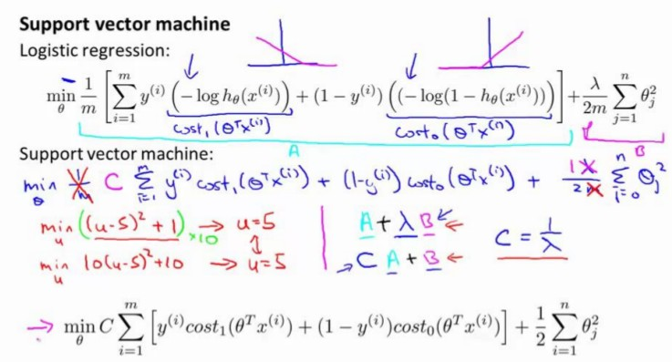

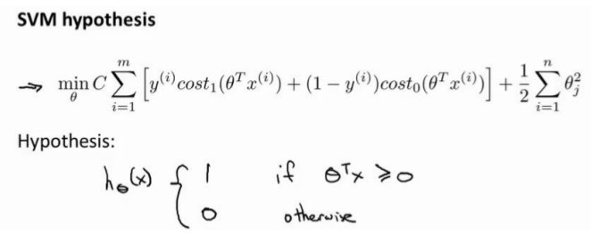

### 12.2 Large Margin Intuition(大边界的直观理解)

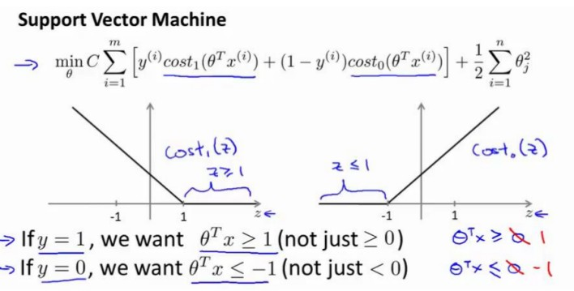

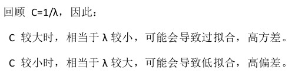

### 12.3 Mathematics Behind Large Margin Classification(数学背后的大边界分类)

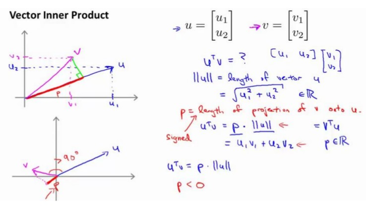

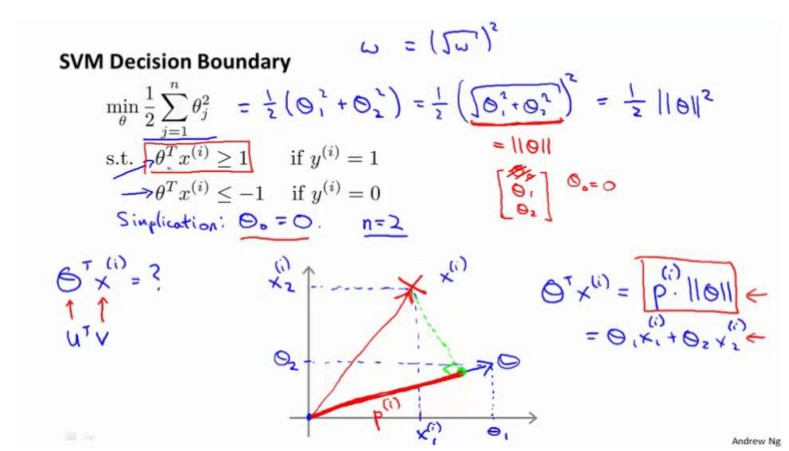

支持向量机做的全部事情,就是极小化参数向量 θ 范数的平方,或者说长度的平方。

支持向量机是一个大间距分类器。

### 12.4 Kernels 1 (核函数 1)

给定一个训练实例x，我们利用x的各个特征与我们预先预定的地标l1,l2,l3的近似程度来选区新的特征f1,f2,f3。

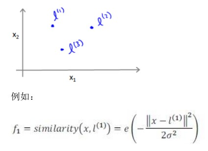

上例的similarity就是核函数，具体而言，这里是一个高斯核函数。

这些地标的作用是什么？如果一个训练实例x与地标L之间的距离近似于0，则新特征f近似于1，如果训练实例x与地标L之间距离较远，则f近似于0.

假设我们的训练实例含有两个特征[x1 x2]，给定地标L与不同的σ值，见下图：

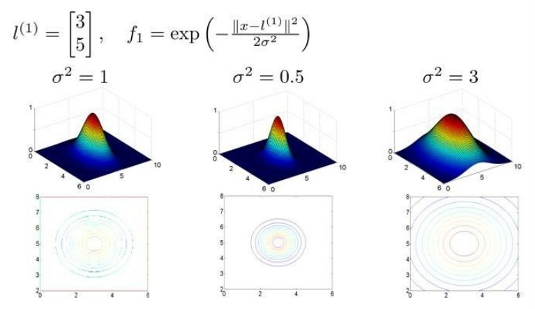

σ值越大，下降越慢

在下图中，当实例处于洋红色的点位置处，因为其离l1更近，但是离l2和l3较远，因此f1接近1，而f2,f3接近0.

因此h(x)=θ0+θ1f1+θ2f2+θ1f3>0,因此预测y=1。

同理可以求出，对于离l2较近的绿色点，也预测y=1，但是对于蓝绿色点，因为其离三个地标都较远，预测y=0。

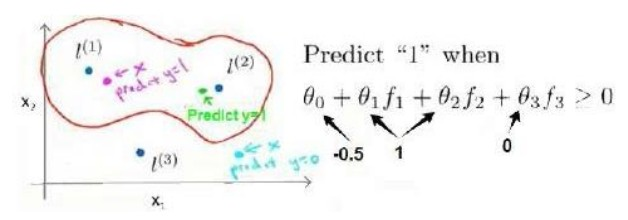

这样，图中红色的封闭曲线所表示的范围，便是我们依据一个单一的训练实例和我们选取的地标所得出的判定边界，在预测时，我们采用的不是训练特征实例本身的值，而是通过核函数计算出的新特征f1,f2,f3。

### 12.5 Kernels 2（核函数 2）

如何选择地标？

我们通常根据训练集的数量选择地标的数量，即如果训练集中有m个实例，则我们选取m个地标，并且令：Lm=xm。这样做的好处是：现在我们得到的新特征是建立在原有特征与训练集中所有其他特征之间距离的基础之上的，即：

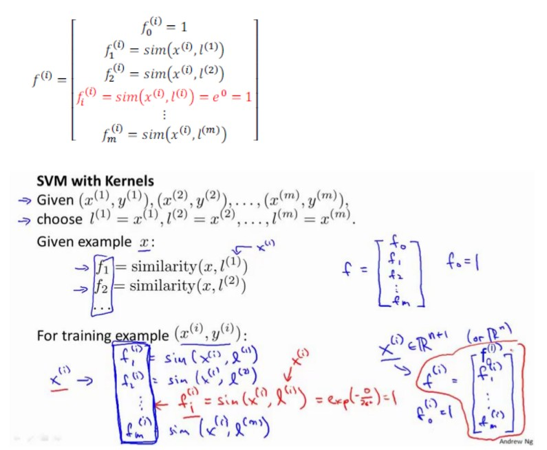

下面我们将核函数运用到支持向量机中，修改我们的支持向量机假设为：

1. 给定x,计算新特征f，当θTf>=0时，预测y=1，否则反之。相应地修改代价函数为：

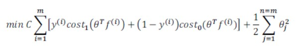

在具体实施过程中，我们还需要对最后归一化项进行些微调，在计算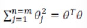时，我们用θTMθ代替θTθ，其中M是根据我们选择的核函数而不同的一个矩阵。这样做的原因是为了简化计算。

理论上将，我们也可以在逻辑回归中使用核函数，但是上面使用M来简化计算的方法不适用于逻辑回归，因此计算将非常耗费时间。

在此，我们不介绍最小化支持向量机的代价函数的方法，你可以使用现有的软件包。在使用这些软件包最小化我们的代价函数之前，我们通常需要编写核函数，并且如果我们使用高斯核函数，那么在使用之前进行特征缩放是非常必要的。

另外，支持向量机也可以不使用核函数，不使用核函数又称为线性核函数，当我们不采用非常复杂的函数，或者我们的特征集特征非常多而实例非常少的时候，可以采用这种不带核函数的支持向量机。

下面是支持向量机的两个参数C和σ的影响：
C 较大时,相当于 λ 较小,可能会导致过拟合,高方差;
C 较小时,相当于 λ 较大,可能会导致低拟合,高偏差;
σ 较大时,导致高方差;
σ 较小时,导致高偏差。

### 12.6 Using An SVM(使用支持向量机)

SVM最优化的问题很复杂，因此我们最好用软件库来实现，比较好的两个选择是liblinear和libsvm，但也有很多的软件库可以用来做这件事。

在高斯核函数之外我们还有其他一些选择，如：

1. 多项式核函数（Polynomial Kernel）
2. 字符串核函数（String kernel）
3. 卡方核函数（chi-square kernel）
4. 直方图交集核函数（histogram intersection kernel）

等等。。

这些核函数的目标也都是根据训练集和地标之间的距离来构建新特征，这些核函数需要满足Mercer's定理，才能被支持向量机的优化软件正确处理。

多类分类问题：

假设我们利用之前介绍的一对多方法来解决一个多类分类问题。如果一共有k个类，则我们需要k个模型，以及k个参数向量θ。我们同样也可以训练k个支持向量机来解决多分类问题。

但是大多数支持向量机软件包都有内置的多类分类功能，我们只要直接使用即可。

尽管你不去写你自己的SVM优化软件，但是你也需要做几件事：

1. 提出参数C的选择。我们在之前的视频中讨论过偏差/方差在这方面的性质。（C越大，方差越大）
2. 选择内核参数或你想要使用的相似函数。（其中一个选择是不需要内核参数时也叫线性核函数）

从逻辑回归，我们得到了支持向量机的模型，在两者之间，我们应该如何选择呢？

n为特征数，m为训练样本数。
1. 如果相较于m而言，n要大许多，即训练集数据量不够支持我们训练一个复杂的非线性模型，我们选用逻辑回归模型或者不带核函数的SVM。
2. 如果n较小，而且m大小中等，例如n在1-1000之间，而m在10-10000之间，使用高斯核函数的SVM。
3. 如果n较小，而m较大，例如n在1-1000之间，而m大于50000，则使用SVM会非常慢，解决方案是创造，增加更多的特征，然后使用逻辑回归或不带核函数的SVM。

值得一提的是，神经网络在以上的三中情况下都可能会有较好的表现，但是训练神经网络可能非常慢，选择SVM的原因主要在于它的代价函数是凸函数，不存在局部最小值。

今天的SVM包会工作得很好，但是它们仍然会有一些慢。当你有非常非常大的训练集，且用高斯核函数是在这种情况下，我经常会做的是尝试手动地创建，拥有更多的特征变量，然后用逻辑回归或者不带核函数的支持向量机。

最后，神经网络使用于什么时候呢？对于所有的这些问题，对于所有的这些不同体系，一个设计得很好的神经网络也很有可能会非常有效。有一个缺点是，或者说是有时可能不会使用神经网络的原因是：
1. 对于许多这样的问题，神经网络训练起来可能会特别慢，但是如果你有一个非常好的SVM实现包，它可能会运行得比神经网络块的多。
2. SVM具有的优化问题，是一种凸优化问题。因此好的SVM优化软件包总是会找到全局最小值，或者接近它的值。对于SVM你不需要担心局部最优。而在实际应用中，局部最优问题在神经网络中不是很大，但是也不小。