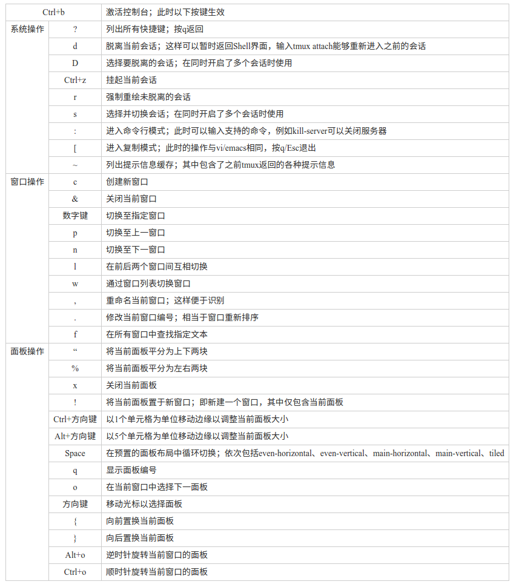

# tmux使用笔记

https://wiki.freebsdchina.org/software/t/tmux
http://wdxtub.com/2016/03/30/tmux-guide/
http://harttle.com/2015/11/06/tmux-startup.html

tmux使用C/S模型构建，主要包括以下单元模块：
1. server服务器。输入tmux命令时就开启了一个服务器。
2. session会话。一个服务器可以包含多个会话
3. window窗口。一个会话可以包含多个窗口。
4. pane面板。一个窗口可以包含多个面板。

## 常用按键

C代表前缀，默认是Ctrl+b(装了gpakosz/.tmux的配置也可以Ctrl+a)

|命令|功能|
|---|---|
|tmux new -s name|创建session，名字为name|
|tmux rename -t session1 session2|重命名 session1 为 session2|
|tmux ls|查看当前server有哪些session|
|tmux a(or at, or attach) -t myname|选中名字为myname的session|
|tmux at -d|重绘窗口，在大小不同屏幕上用 tmux 时候会保持窗口大小为最小尺寸，这个命令就可以重置窗口大小。|
|tmux kill-session -t name|干掉指定名字的会话，关闭会话所有窗口自动会关掉会话。|
|tmux kill-window -t name|关闭指定窗口，很少用，一般都是 Ctrl-b & 关闭本窗口。|
|Ctrl-b d|脱离会话回到终端|
|Ctrl-b [|进入复制模式，滚屏查看，支持 vim 上下翻页快捷键。|
|Ctrl-b c|新建窗口|
|Ctrl-b &|关闭窗口|
|set-window-option -g mode-keys vi|设置复制模式中键盘布局为 vi|
|Ctrl-b w|列出所有窗口，可用 vim j/k 上下翻页|
|Ctrl-b : - rename-window|重命名窗口|
|Ctrl-b n/p|切换到下一个/前一个窗口，也可以直接用 Ctrl-b 数字 切换到指定窗口。|
|Ctrl-b %/"|分割窗口为面板(panel)。|
|Ctrl-b x|关闭面板|