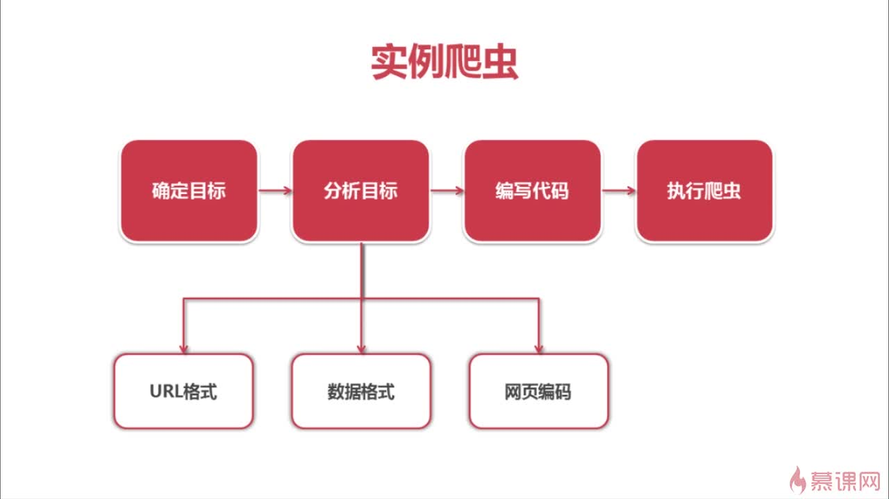

##  1. 爬虫简介

爬虫：一段自动抓取互联网信息的程序。

## 2. 简单爬虫架构

## 3. URL管理器

作用：管理抓取URL集合和已抓取URL集合

目的：防止重复抓取，循环抓取

实现方式：

1. 小型使用内存，set（）可去除列表中重复的元素
2. 永久存储使用关系数据库 MySQL
3. 大型公司出于性能考虑，使用缓存数据库 redis

### 4. 网页下载器（核心）

作用：将互联网上URL对应的网页下载到本地的工具

- urlib2 : 官方自带的基础模块
- requests : 第三方库 
    - requests.get(url)

#### 4.1 urllib2

### 网页解析器

作用：从网页中提取有价值数据的工具

- 正则 : re
- html.parser
- BeautifulSoup
- lxml : 需安装lxml第三方库,xpath

### 实例爬虫

